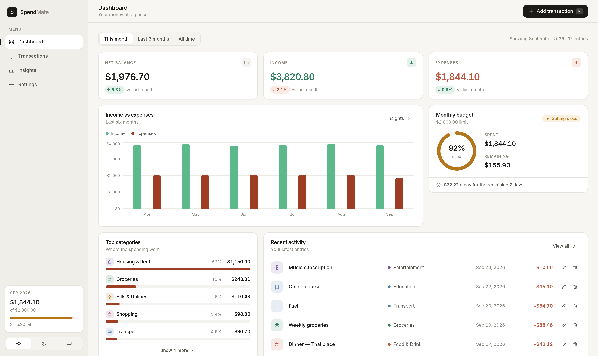
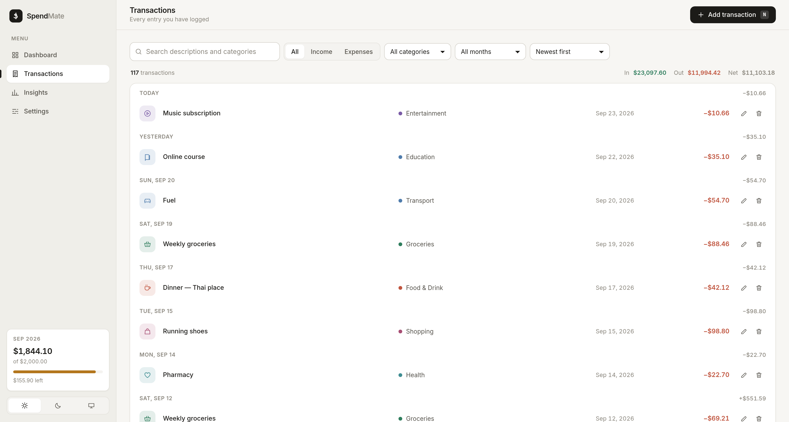
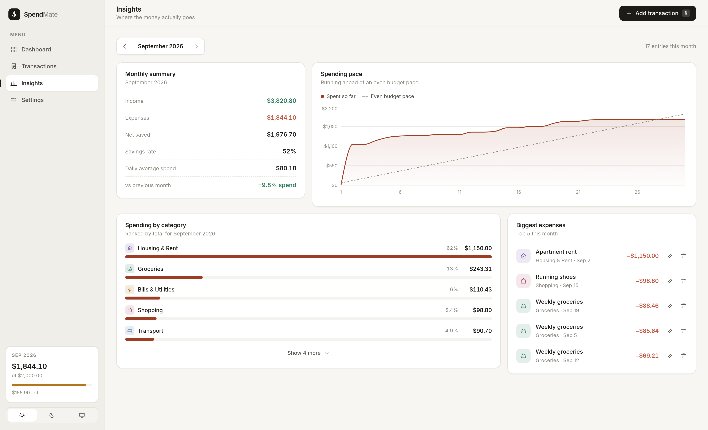
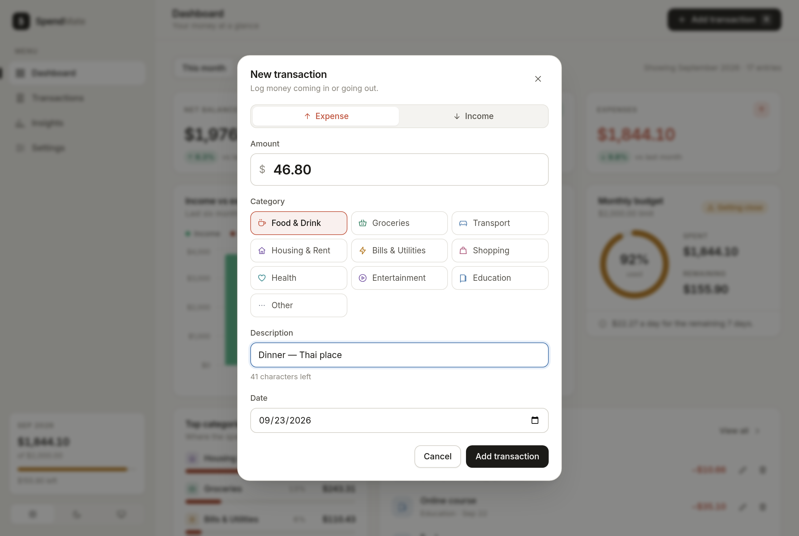
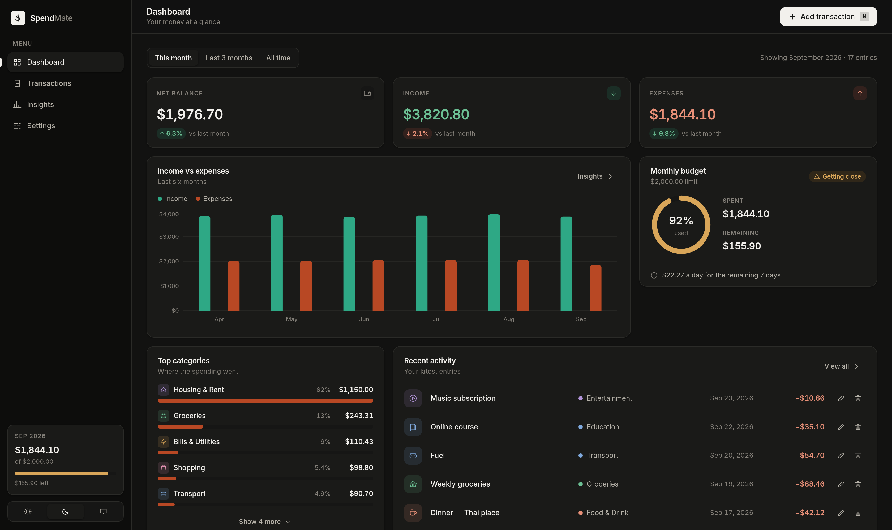
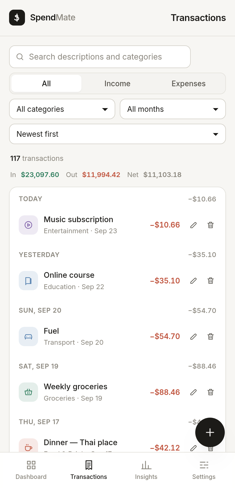

# SpendMate

A personal expense tracker that runs entirely in the browser. Log income and expenses,
watch a running balance, set a monthly budget, and see where the money actually goes —
with everything persisted to `localStorage`, so a refresh never costs you data.

Built for the React course project (Section 4, Option 2 — Personal Expense Tracker).



---

## Contents

- [Features](#features)
- [Screenshots](#screenshots)
- [Tech stack](#tech-stack)
- [Getting started](#getting-started)
- [Project structure](#project-structure)
- [How it works](#how-it-works)
- [Design notes](#design-notes)
- [Known limitations](#known-limitations)

---

## Features

### Core requirements

| Requirement | Where it lives |
| --- | --- |
| Add transactions with amount, category and description | `TransactionSheet` — a validated, fully controlled form |
| Running balance (income − expenses) | `StatCard` row on the Dashboard, with month-over-month deltas |
| List every transaction, delete individual entries | `TransactionList` / `TransactionRow`, grouped by day |
| Filter and sort by category, type, month or free text | `FilterBar` + `applyFilters` / `sortTransactions` |
| Persist with `localStorage` | `useLocalStorage` hook, wired through `TransactionsProvider` |

### Stretch goals

- **Charts** — a six-month income-vs-expenses bar chart and a cumulative *spending pace*
  chart that plots real spend against an even budget line.
- **Monthly summary view** — the Insights page steps month by month with savings rate,
  daily average, biggest expenses and a month-over-month comparison.
- **Budget limit with warnings** — set a monthly cap and SpendMate tracks it with a
  progress ring, a "getting close" state at 80%, an over-budget state, and a daily
  allowance for the days left in the month.
- **Dark / light / system theme**, remembered between visits and following the OS
  while set to *System*.

### Beyond the brief

- **Edit** transactions, not just add and delete.
- **Undo** — deleting shows a toast with an undo action instead of a confirm dialog.
- **Keyboard shortcut** — press <kbd>N</kbd> anywhere to open a new transaction.
- **Import / export** your ledger as JSON, plus a one-click sample dataset.
- **Empty, loading and error states** throughout — including separate copy for
  "you have no data yet" and "nothing matched your filters".
- **Accessible dialogs** — focus is trapped and restored, <kbd>Esc</kbd> closes, and
  background scrolling is locked.

---

## Screenshots

| Transactions | Insights |
| --- | --- |
|  |  |

| Add transaction | Dark theme |
| --- | --- |
|  |  |

<p align="center">
  
</p>

---

## Tech stack

| Tool | Why |
| --- | --- |
| **React 18** (functional components + hooks only) | Core of the assignment |
| **Vite 5** | Dev server and build |
| **React Router 6** | Four routes: Dashboard, Transactions, Insights, Settings |
| **Recharts 2** | The two charts — lazy-loaded so it stays out of the main bundle |
| **Plain CSS with custom properties** | One token file drives both themes; no UI kit, so nothing looks off-the-shelf |
| **ESLint 9** | `npm run lint` passes clean |

No backend, no API keys, no analytics. Everything is local to your browser.

---

## Getting started

```bash
npm install
npm run dev          # http://localhost:5173
```

Other scripts:

```bash
npm run build        # production build into dist/
npm run preview      # serve the production build locally
npm run lint         # ESLint over the whole project
```

On first run SpendMate seeds a demo ledger covering the last six months so the charts
have something to show. Clear it any time from **Settings → Your data → Delete everything**.

---

## Project structure

```
src/
├── components/          reusable UI — each with its own stylesheet
│   ├── charts/          Recharts wrappers + the lazy-loading boundary
│   ├── AppShell.jsx     sidebar, topbar, mobile tab bar, routed outlet
│   ├── TransactionSheet.jsx   the add/edit form
│   ├── TransactionList.jsx    day-grouped list + loading skeleton
│   ├── FilterBar.jsx    controlled filter/sort row
│   ├── BudgetCard.jsx   budget ring and pace note
│   └── Modal.jsx        focus-trapped dialog used by the form and confirms
├── context/             providers for settings, transactions and toasts
├── data/                category catalogue and the demo dataset
├── hooks/               useLocalStorage, useBudgetStatus, context consumers
├── pages/               Dashboard, Transactions, Insights, Settings
├── styles/              tokens.css, base.css, ui.css
└── utils/               formatting and pure derivation helpers
```

Context objects live in `context/contexts.js`, separate from the provider components
and the consumer hooks, so every module exports one kind of thing and Fast Refresh
stays reliable.

---

## How it works

**State.** Transactions and settings each live in a context provider backed by the
`useLocalStorage` hook. That hook reads storage lazily in the `useState` initialiser and
writes back in a `useEffect`, skipping the first render so it never rewrites what it just
read. Every storage call is wrapped in `try/catch`, because `localStorage` throws in
private-browsing modes — the app keeps working from memory if it does.

**Derived data, not stored data.** Balances, category totals, monthly series and budget
health are never stored; they are computed from the transaction list by pure functions in
`utils/stats.js` and memoised at the call site. There is one source of truth, so nothing
can drift out of sync.

**Props and callbacks.** Pages own the filter state and pass it down to `FilterBar` with
an `onChange` callback; `AppShell` owns the editor state and hands `openEditor` to its
pages through the router's outlet context. Presentational components such as
`TransactionRow` and `StatCard` hold no state of their own.

### React concepts, and where to find them

| Concept | Example |
| --- | --- |
| `useState` | `TransactionSheet.jsx` (form + touched fields), `Dashboard.jsx` (period) |
| `useEffect` | `useLocalStorage.js` (persistence), `SettingsProvider.jsx` (theme + `matchMedia`), `AppShell.jsx` (keyboard shortcut) |
| `useMemo` | `Dashboard.jsx`, `Insights.jsx`, `Transactions.jsx` — filtering and aggregation |
| `useCallback` | `TransactionsProvider.jsx` — stable action identities |
| `useRef` | `Modal.jsx` (focus trap), `Settings.jsx` (hidden file input) |
| `useContext` | `useTransactions`, `useSettings`, `useToast` |
| Custom hooks | `useLocalStorage`, `useBudgetStatus`, `useDeleteTransaction` |
| List rendering with keys | `TransactionList.jsx`, `CategoryBreakdown.jsx`, `FilterBar.jsx` |
| Conditional rendering | loading skeletons, two distinct empty states, budget states, toast actions |
| Controlled forms | `TransactionSheet.jsx`, `FilterBar.jsx`, `Settings.jsx` |
| Routing | `App.jsx` + `AppShell.jsx` (`NavLink`, `Outlet`, outlet context) |
| Portals | `Modal.jsx` |
| Code splitting | `charts/LazyCharts.jsx` (`React.lazy` + `Suspense`) |

---

## Design notes

**Two themes from one token file.** Every colour is declared once in
`styles/tokens.css` and re-declared under `[data-theme='dark']`. Nothing else in the
codebase contains a hex value.

**Chart colours are verified, not eyeballed.** The interface green and red are tuned for
text contrast, which leaves them too close together for red-green colour blindness when
they sit side by side as chart fills. The charts therefore use their own pair
(`--chart-income` / `--chart-expense`), checked in both themes for lightness banding,
chroma, contrast against the chart surface, and colour-vision separation. The category
breakdown avoids the problem differently: it is a ranked bar list in a single hue, with
every row directly labelled, so it reads by length and text rather than by colour.

**Numbers are comparable.** Anything showing money uses tabular figures, so digits line
up in a column.

**Responsive by layout, not by hiding.** Three columns become two, then one. Below 640px
the sidebar is replaced by a bottom tab bar and a floating add button, and the dialog
becomes a bottom sheet. Nothing is dropped on small screens except decoration.

---

## Known limitations

- **Single device, single browser.** Data lives in `localStorage`, so it does not sync
  between devices and clearing site data clears the ledger. Use the JSON export as a
  backup.
- **No recurring transactions.** Monthly bills such as rent must be entered each month.
- **One budget for everything.** The budget is a single monthly cap rather than a limit
  per category.
- **Categories are fixed.** The catalogue in `data/categories.js` covers common cases but
  cannot be edited from the UI.
- **No multi-currency conversion.** Changing the currency in Settings changes the symbol
  and formatting; it does not convert amounts already entered.
- **Deploying to a subpath** (such as GitHub Pages project sites) needs `base` set in
  `vite.config.js`; the app uses `BrowserRouter`, so the host must also rewrite unknown
  paths to `index.html`. Netlify and Vercel do this out of the box.
